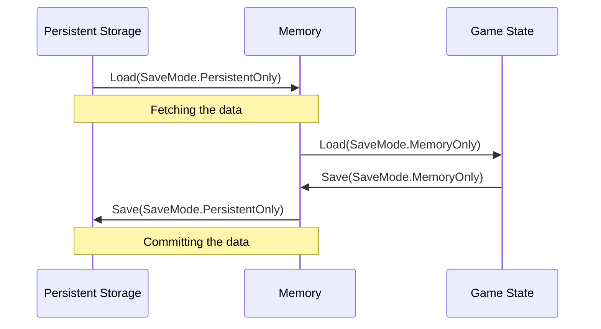

# Basic concepts

To understand how Safekeeper works, it's important to think about where the save
data is stored.

The following diagram illustrates the complete process of first loading the data
and then saving it back:



### Persistent storage

The persistent storage is the place where the actual save data is stored. It can
be a file on the disk, a browser's local storage, a cloud, etc. Once the data is
stored here, it will persist even after the game is closed. From the player's
perspective, the game has been saved only if it has been committed to the
persistent storage.

### Memory

The memory is a staging area for our save data. When saving the game state we
start by serializing it into the memory. The game can then continue as usual
while the data is asynchronously committed to the persistent storage.

### Game state

As the name suggests, the game state is the current state of our game as
represented by game objects. Once the save data is loaded into the memory, we
can deserialize it and apply the values to the objects in the scene.

## Saving and loading

In the diagram above, `loading` means moving the save data from left to right.
Analogically, `saving` means moving the date in the opposite direction. Note
that we don't need to always go all the way. For example, sometimes it may be
useful to save the data only in the memory.

Imagine the following scenario: The player is in `Scene A` and knocks over a
vase. They then leave `Scene A` and move to `Scene B`. We'd like to store the
information about the vase so that when the player returns to `Scene A` it's in
the same state they left it in. At the same time, our game uses a checkpoint
system, where the game is saved only in key moments of the story. We don't want
to save it each time the player switches scenes.

In this case, saving the game only in the memory would be a good solution. When
the player returns to `Scene A`, we can load the data from the memory and apply
it to the vase. But only commit it to the persistent storage when the player
reaches a checkpoint.

Additionally, we can allow the player to go back to the previous checkpoint by
purging the in-memory data and loading it again from the persistent storage.

## Save Controllers

In Safekeeper, each save slot is represented by an instance of the
[`SaveControllerBase`](xref:Aarthificial.Safekeeper.SaveControllerBase) class.
It serves as a handle to the underlying data and provides methods to
[save](<xref:Aarthificial.Safekeeper.SaveControllerBase.Save(Aarthificial.Safekeeper.SaveMode)>),
[load](<xref:Aarthificial.Safekeeper.SaveControllerBase.Load(Aarthificial.Safekeeper.SaveMode)>),
and [clear](xref:Aarthificial.Safekeeper.SaveControllerBase.Delete) the slot.

When instantiating a new save controller, you need to provide it with an
[`ISaveLoader`](xref:Aarthificial.Safekeeper.Loaders.ISaveLoader). The loader is
responsible for communicating with the persistent storage. Safekeeper comes with
a few built-in loaders, but you can also implement your own:

- [`FileSaveLoader`](xref:Aarthificial.Safekeeper.Loaders.FileSaveLoader) -
  Loads and saves the data to a file on the disk using Unity's persistent
  storage path.
- [`DummySaveLoader`](xref:Aarthificial.Safekeeper.Loaders.DummySaveLoader) -
  Does nothing. Useful for testing.

After the save controller is instantiated, you need to initialize it by calling
the [`Initialize`](xref:Aarthificial.Safekeeper.SaveControllerBase.Initialize)
method. This is an asynchronous operation, so it may take a while for the
controller to be ready. You can await the returned task or check its status by
reading the
[`IsLoading`](xref:Aarthificial.Safekeeper.SaveControllerBase.IsLoading)
property.

> [!NOTE]
>
> The controller uses a semaphore so its safe to call other methods before the
> initialization is complete. They will be queued and executed once the
> controller is ready.

## Save data

Once the save controller has been initialized and the persistent data has been
fetched for the first time, you can access the in-memory data by reading the
[`Data`](xref:Aarthificial.Safekeeper.SaveControllerBase.Data) property.

It provides a few method for reading and writing the data, similarly to Unity's
`JsonUtility`:

```csharp
class StoredData {
    public int health;
    public int mana;
}

var location = new SaveLocation("global", "player");

// Reading the data as a new instance:
var data = controller.Data.Read<StoredData>(location);

// Reading the data into an existing instance:
controller.Data.Read(location, data);

// Writing the data:
controller.Data.Write(location, data);
```

### Save locations

In order to read and write the data, we need to specify the
[`SaveLocation`](xref:Aarthificial.Safekeeper.SaveLocation). It's a simple
structure that contains two strings: `chunkId` and `objectId`. For
organizational purposes, objects store in the save data are grouped into chunks.
This allows us to reuse Unity's [`GlobalObjectId`][GlobalObjectId] to
automatically generate unique locations for our objects.

If you want to automatically generate the location for a component, add
[`ObjectLocationAttribute`](xref:Aarthificial.Safekeeper.ObjectLocationAttribute)
to a serialized `SaveLocation` field:

```csharp
public class MyComponent : MonoBehaviour {
  [ObjectLocation]
  public SaveLocation Location;
}
```

For ScriptableObjects, you can use
[`AssetLocationAttribute`](xref:Aarthificial.Safekeeper.AssetLocationAttribute):

```csharp
public class MyScriptableObject : ScriptableObject {
  [AssetLocation("my-assets")]
  public SaveLocation Location;
}
```

[GlobalObjectId]: https://docs.unity3d.com/ScriptReference/GlobalObjectId.html
